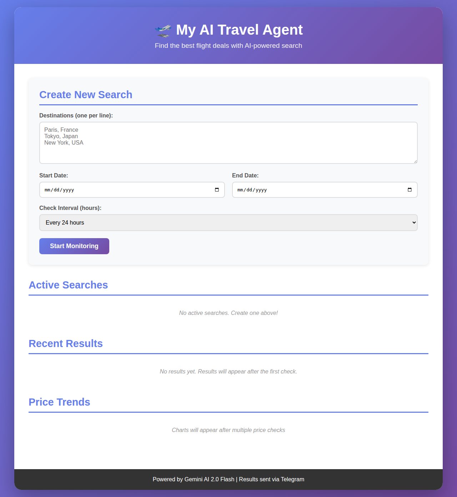
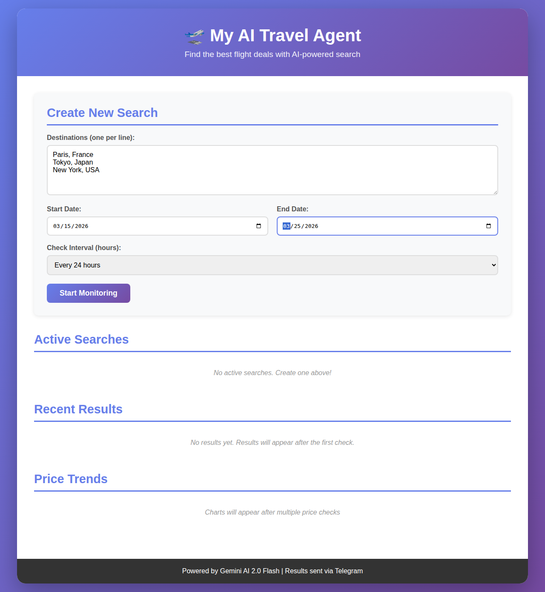
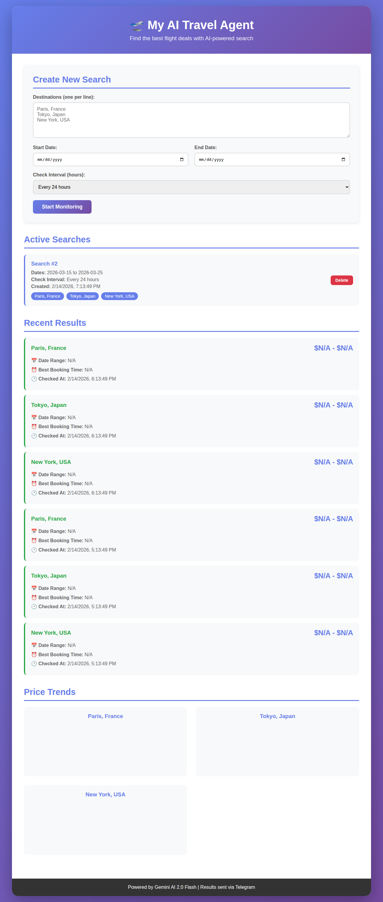

# AI Travel Agent - User Interface Guide

This guide provides step-by-step instructions for using the AI Travel Agent web interface.

## Table of Contents
- [Getting Started](#getting-started)
- [Main Dashboard](#main-dashboard)
- [Creating a New Search](#creating-a-new-search)
- [Viewing Active Searches](#viewing-active-searches)
- [Monitoring Results](#monitoring-results)
- [Analyzing Price Trends](#analyzing-price-trends)
- [Managing Searches](#managing-searches)

## Getting Started

Once you have the application running (using Docker, Docker Compose, or manually), open your web browser and navigate to:
```
http://localhost:5000
```

## Main Dashboard

The main dashboard is your control center for monitoring flight prices.



The dashboard consists of four main sections:
1. **Create New Search** - Set up new flight price monitoring
2. **Active Searches** - View and manage your current searches
3. **Recent Results** - See the latest price checks
4. **Price Trends** - Analyze price changes over time with charts

## Creating a New Search

To start monitoring flight prices:



1. **Enter Destinations**
   - Type each destination on a new line
   - Example:
     ```
     Paris, France
     Tokyo, Japan
     New York, USA
     ```
   - You can add as many destinations as you want

2. **Select Travel Dates**
   - **Start Date**: Click the calendar icon and choose your departure date
   - **End Date**: Click the calendar icon and choose your return date

3. **Choose Check Interval**
   - Select how often you want the AI to check prices:
     - Every hour (for frequent updates)
     - Every 6 hours
     - Every 12 hours
     - **Every 24 hours** (recommended for daily monitoring)
     - Every 48 hours (for less frequent checks)

4. **Start Monitoring**
   - Click the "Start Monitoring" button
   - Your search will be created and added to Active Searches
   - The AI will begin checking prices at your specified interval

## Viewing Active Searches



The **Active Searches** section displays all your current monitoring searches.

Each search card shows:
- **Search ID** - Unique identifier (e.g., "Search #1")
- **Dates** - Your travel date range
- **Check Interval** - How often prices are checked
- **Created** - When you created this search
- **Destinations** - List of all locations being monitored
- **Delete Button** - Remove the search when no longer needed

### Search Details

- Multiple searches can run simultaneously
- Each search monitors all specified destinations
- Searches run automatically in the background
- No need to keep the browser open once started

## Monitoring Results

The **Recent Results** section shows the latest price checks from all your searches.

### Result Card Information

Each result displays:
- **Destination Name** - The location checked (e.g., "Paris, France")
- **Price Range** - Current price estimates
  - Minimum price
  - Maximum price
- **Date Range** - The travel dates for this quote
- **Best Booking Time** - AI recommendations for when to book
- **Checked At** - Timestamp of when this price was retrieved

### Understanding Results

- Results are sorted by most recent first
- Each destination in your search gets its own result card
- AI uses Google Gemini 2.0 Flash to provide intelligent price estimates
- Results are automatically sent to your Telegram chat

### No Results Yet?

If you see "No results yet. Results will appear after the first check":
- This is normal for new searches
- Wait for the first check interval to complete
- Results will appear automatically once the AI performs the first price check

## Analyzing Price Trends

The **Price Trends** section provides visual charts showing how prices change over time.

### Chart Features

For each destination, you'll see:
- **Destination Name** - Location being tracked
- **Line Chart** - Visual representation of price changes
  - X-axis: Time/date of checks
  - Y-axis: Price in your currency
- **Price Points** - Each data point represents a price check

### Using Charts

Charts help you:
- Identify price trends (rising, falling, or stable)
- Spot the best time to book
- Compare prices across different check times
- Make informed booking decisions

### When Do Charts Appear?

- Message "Charts will appear after multiple price checks" shows initially
- At least 2 price checks are needed to generate a chart
- Charts automatically update as new prices are checked
- Each destination gets its own independent chart

## Managing Searches

### Deleting a Search

To stop monitoring a search:
1. Locate the search in the **Active Searches** section
2. Click the red **Delete** button
3. The search will be removed immediately
4. Price checking for this search will stop

### Creating Multiple Searches

You can create multiple searches for different trips:
- Each search can have different destinations
- Each search can have different date ranges
- Each search can have different check intervals
- All searches run independently

### Best Practices

1. **Use Realistic Date Ranges**
   - Set dates that match when you actually plan to travel
   - Prices can vary significantly by season

2. **Choose Appropriate Check Intervals**
   - For urgent bookings: Check every 1-6 hours
   - For planning ahead: Check every 24 hours
   - To conserve API calls: Check every 48 hours

3. **Monitor Your Telegram**
   - All results are sent to your configured Telegram chat
   - You'll receive notifications even when away from the dashboard
   - Keep the bot chat active for real-time updates

4. **Delete Completed Searches**
   - Remove searches after booking your flights
   - This reduces API usage and keeps your dashboard clean

## Notifications

All price check results are automatically sent to your Telegram chat, including:
- Price estimates for each destination
- AI-powered booking recommendations
- Travel date ranges
- Timestamp of the check

This allows you to monitor prices on the go without keeping the web interface open.

## Troubleshooting

### Common Issues

**Problem**: "Loading searches..." or "Loading results..." appears indefinitely
- **Solution**: Refresh the page. Check that the application is running correctly.

**Problem**: "Failed to load searches" or "Failed to load results"
- **Solution**: Check your environment variables (API keys) are configured correctly

**Problem**: No prices showing (all showing "$N/A")
- **Solution**: Ensure your Gemini API key is valid and has available quota

**Problem**: Charts not displaying
- **Solution**: 
  - Check browser console for errors
  - Ensure Chart.js library is loading
  - Wait for at least 2 price checks to complete

### Getting Help

If you encounter issues:
1. Check the application logs
2. Verify all environment variables are set correctly
3. Ensure API keys are valid and active
4. Check your internet connection
5. Open an issue on the GitHub repository

## Technical Notes

- **AI Model**: Uses Google Gemini 2.0 Flash for intelligent price analysis
- **Database**: SQLite stores all searches and results locally
- **Scheduling**: APScheduler handles automated price checks
- **Frontend**: Vanilla JavaScript with Chart.js for visualizations
- **Backend**: Python Flask serving the REST API

## Privacy & Data

- All data is stored locally in a SQLite database
- No data is sent to third parties except:
  - Google Gemini API for price analysis
  - Telegram API for notifications
- You can delete your data by removing the database file

---

For more information, visit the [main README](../README.md) or the [GitHub repository](https://github.com/sagipael/Ai-Travel-agent).
